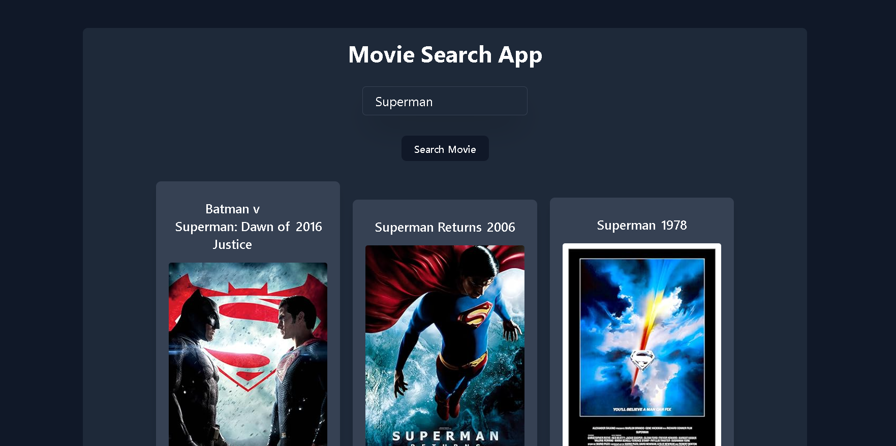

# 🎬 Movie Search App

A sleek and responsive movie search web app that lets users find movie details using the OMDB API. Built with HTML, Tailwind CSS, and JavaScript.

🔗 **Live Demo** : https://mjmoviesearchapp.vercel.app/



---

## 🚀 Features

- 🔍 Search for movies by title in real-time
- 🖼️ Display movie poster, title, and release year
- 📱 Responsive UI powered by Tailwind CSS
- 🔐 API key managed via `config.js` file

---

## 🛠️ Tech Stack

- **HTML** – Markup structure
- **Tailwind CSS** – Styling with utility-first classes
- **JavaScript (Vanilla)** – DOM handling and API fetching
- **OMDB API** – External data source for movie info

---

## 📁 Project Structure

```

movie-search-app/
├── index.html
├── config.js           # Your OMDB API key file
├── package.json
├── README.md
├── .gitignore
├── src/
│   ├── input.css       # Tailwind source
│   ├── output.css      # Tailwind compiled CSS
└── linkedin post data/
└── 2025-05-08 18-27-56.mp4

````

---

## ⚙️ Getting Started

### 📦 Installation

```bash
git clone https://github.com/jalal1122/movie-search-app.git
cd movie-search-app
npm install
```

### 🧪 Usage

1. Start Tailwind in watch mode:

   ```bash
   npx tailwindcss -i ./src/input.css -o ./src/output.css --watch
   ```
2. Open `index.html` in your browser.

---

## 🔐 API Setup

Get a free API key from [OMDB API](https://www.omdbapi.com/apikey.aspx) and place it in the `config.js` file:

```js
// config.js
const API_KEY = "your_api_key_here";
```

---

## 📜 License

Licensed under the [ISC License](LICENSE).

---

## 🙋‍♂️ Author

Developed with ❤️ by [Muhammad Jalal](https://github.com/jalal1122)

---
